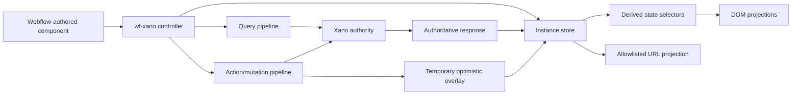

# 🧭 wf-xano Reactive Runtime Migration Plan

Last updated: 2026-07-15
Owner: The Starters Platform / wf-xano maintainers
Status: Phase 0–2 merged; Phase 3 implementation in validation

## 📌 TL;DR

- Keep `wf-algolia` as the search-heavy browse layer. This plan upgrades `wf-xano` into a small,
  reactive application runtime for authoritative, member-scoped Xano state.
- Borrow React's state model—not React or a virtual DOM. Webflow remains the visual component
  editor; Xano remains the server-state and mutation authority.
- Migrate in two independent tracks: first add an opt-in runtime behind the current public API,
  then migrate consumer pages one capability at a time.
- No dual writes. Read-only shadow comparisons may run old and new derivations against the same
  response, but every server mutation is sent exactly once to Xano.
- Every phase is additive, disabled by default for existing markup, covered in source and minified
  builds, and independently releasable and reversible.
- The first implementation phase is the invisible store foundation. Generic actions, optimistic
  mutations, keyed reconciliation, and forms come only after the store contract is stable.

## 📊 Progress

| Phase | Status | Owner | Evidence / Link | Notes |
| --- | --- | --- | --- | --- |
| Current runtime audited | ✅ Complete | Codex | `wf-xano.js`, `docs/api.md`, tests | v0.18.3 baseline: 54 runtime tests + prompt tests |
| Migration/drift contract defined | ✅ Complete | Codex | This document | Xano authority and projections documented |
| Plan approved | ✅ Complete | Product + Platform | User authorization in Codex task | Phase 0–3 implementation authorized |
| Phase 0 compatibility harness | ✅ Complete | wf-xano maintainer | `test/reactive-runtime-parity.test.mjs`, `audit()` | Source/minified parity + local harness established |
| Phase 1 reactive store foundation | ✅ Complete | wf-xano maintainer | v0.19.0 merged in PR #33 | Store/API landed; no production release yet |
| Phase 2 reactive DOM projections | ✅ Complete | wf-xano maintainer | v0.20.0 merged in PR #34; tests 62–65 | Read-only attributes landed; no production release yet |
| Phase 3 generic actions | 🟡 In progress | wf-xano + Xano owner | v0.21.0 branch; tests 66–71 | Pessimistic mocked/test-mode contract only |
| Phase 4 optimistic mutations/reconciliation | 🟡 Implementation complete | wf-xano + Xano owner | 2026-07-15 | Mocked/unit gates passing; browser canary + review pending |
| Phase 5 forms | ⬜ Not started | wf-xano + Product |  | Create/edit flows migrate last |
| Phase 6 consumer rollout | ⬜ Not started | Product + Platform |  | One page/capability per cutover |
| v1 stability gate | ⬜ Not started | Platform |  | No legacy removal in this plan |

Status key: ⬜ Not started, 🟡 In progress, ✅ Complete, ⚠️ Blocked, 🔁 Needs retry.

## 🎯 Goal And Non-Goals

### Goal

Turn each `wf-xano-element="wrapper"` into a predictable component boundary with:

- one observable instance store;
- read-only derived state bindings;
- explicit action and mutation lifecycles;
- Xano-authoritative reconciliation;
- keyed, partial DOM updates where safe;
- cross-instance invalidation;
- declarative form state and server validation;
- backward-compatible attribute and JavaScript APIs.

### Non-goals

- Do not replace `wf-algolia` on search-heavy public browse pages.
- Do not add React, JSX, a virtual DOM, or a frontend build requirement to consumer pages.
- Do not make browser state authoritative for identity, entitlements, permissions, or records.
- Do not create Airtable, Make, local-storage, or Webflow CMS mirrors of new v3 state.
- Do not allow arbitrary DOM attributes or URL parameters to become action payloads.
- Do not remove legacy `wf-xano-*` grammar during this migration.
- Do not combine the library upgrade with a production Webflow page rewrite.

## 🧱 Tech Stack

| Area | System | Responsibility |
| --- | --- | --- |
| Visual UI | Webflow | Authored structure, classes, accessible labels, component layout |
| Client runtime | `wf-xano` | Transient store, binding, actions, request sequencing, reconciliation |
| Server state | Xano | Canonical v3 data, authorization, validation, mutations, audit history |
| Authentication | Memberstack → Xano token trade | Session authority and authenticated API access |
| Search browse | `wf-algolia` / Algolia | Public discovery, relevance, facets, search-heavy pages |
| Distribution | GitHub tags + jsDelivr | Versioned source/minified browser assets |
| Testing | Node, JSDOM, local examples, browser harness | Contract, lifecycle, DOM, served-asset, and end-to-end verification |

## 🗺️ Target Architecture



The runtime is a state machine and DOM reconciler, not a second database. Reloading from Xano must
always be able to reconstruct the correct server-backed UI state.

## 🔄 Migration Drift Contract

| Contract field | Decision |
| --- | --- |
| Canonical authority | Xano for v3 records and mutation outcomes; Memberstack for login/session; Algolia remains the search read model on search-heavy pages |
| Mirrors / projections | In-memory instance store, optimistic overlay, URL query subset, rendered Webflow DOM, counts/badges, analytics events |
| Stable key | `wf-xano-instance` for a component; Xano record `id` by default; optional explicit `wf-xano-key` only when an endpoint's canonical stable ID uses another field |
| Approved writers | Xano endpoint writes records; the wf-xano controller alone writes its instance store/DOM; URL sync writes only declared query fields |
| Disallowed writers | Page-specific scripts must not independently mutate the same store/DOM state after a component opts into the new runtime; optimistic UI must never write Xano twice |
| Freshness target | Query result reflected immediately after response; optimistic mutation reconciled by its authoritative response; background invalidation begins immediately after success |
| Reconciliation | Compare request envelope, normalized result, stable item IDs/order, totals, lifecycle state, and projected DOM state between legacy and new derivations |
| Repair operation | No data repair is expected for a client-runtime migration. UI repair is `refresh()` from Xano; server-data repair remains a separately approved Xano workflow |
| Monitoring owner | Platform owns release/served-asset checks; the consuming product owner owns browser canaries; Xano owner owns mutation failures and endpoint audit logs |
| Rollback | Remove the opt-in attribute/config or pin the prior tag; never require a server-data rollback for a client-only phase |

### State ownership

| State | Authority | Permitted projection | Persistence |
| --- | --- | --- | --- |
| Member identity/session | Memberstack | In-memory auth fingerprint/token trade status | Session only |
| Record values | Xano | Instance store and rendered DOM | Xano |
| Query parameters | Instance store | Allowlisted URL keys and form controls | URL only when enabled |
| Current page/load mode | Instance store | URL and pagination controls | URL only when enabled |
| Loading/error/empty status | Instance store | Classes, ARIA, state bindings | None |
| Selected rows/local UI | Instance-local state | Classes and local-state bindings | None by default |
| Optimistic mutation | Temporary overlay | Mutating class and projected value | Until success/failure only |
| Mutation result | Xano response | Reconciled store/DOM and invalidated queries | Xano |

## 🔁 Lifecycle Event Matrix

| Event | Store transition | Xano/network behavior | Required reconciliation |
| --- | --- | --- | --- |
| Initial boot | `idle → loading → success/error` | One sequenced list request | Response IDs/totals equal rendered projection |
| Refresh | Keep query state; replace server snapshot | Abort/supersede older read | Stale response cannot win |
| Filter/search/sort | Update allowlisted query; return to page 1 | One latest request | URL, controls, request, and result agree |
| Pagination/load more | Update page/accumulation state | Read next page once | No duplicate/missing stable IDs |
| Back/forward navigation | Restore declared URL projection | Refresh only when state changed | Controls and request hydrate once, without loops |
| Local UI update | Update local slice only | No request | Server/query slices unchanged |
| Pessimistic action | `idle → mutating → success/error` | Exactly one Xano mutation | Apply only authoritative response, then invalidate |
| Optimistic action | Apply temporary overlay | Exactly one Xano mutation | Confirm from response or roll back precisely |
| Duplicate click | Keep one active mutation per action key | Deduplicate or reject duplicate | No duplicate writes/side effects |
| Out-of-order responses | Ignore superseded sequence | Requests may finish out of order | Latest valid transition wins |
| Mutation failure | Roll back overlay; expose safe error | Preserve real 4xx/5xx status | Store/DOM return to pre-mutation snapshot |
| Downstream timeout | Keep retryable error state | Never report phantom success | Refresh can recover from Xano |
| External change | Mark query stale or receive explicit invalidation | Re-fetch authoritative list | Removed/changed rows reconcile by stable ID |
| Logout/account switch | Clear auth/member-scoped stores and overlays | Cancel reads/mutations; re-trade token if logged in | No prior member data remains visible |
| Dynamic wrapper insertion | Initialize one owner instance | Normal initial load | Nested instances remain isolated |
| Destroy/re-init | Abort, unsubscribe, remove projections | No new request after destroy | No orphan listeners/cards/store references |
| Script upgrade | Existing markup remains on legacy behavior unless opted in | No writer change | Old contract suite and minified suite pass |
| Rollback | Disable opt-in or pin prior release | No server change | Refresh reconstructs UI from Xano |

## 🧭 Versioned Execution Plan

### Phase 0 — Compatibility baseline and shadow harness

Target: v0.18.x development branch; no public behavior change.

1. Freeze the v0.18.3 behavior contract in tests:
   - request bodies and headers;
   - response normalization;
   - rendered item IDs/order;
   - controls, URL state, pagination, auth switching, favorites, lifecycle teardown;
   - source and minified artifact parity.
2. Add a deterministic fixture matrix for array, single-record, paged, empty, invalid, delayed,
   error, duplicated, and out-of-order responses.
3. Add a read-only audit helper that can compare two derived snapshots without printing record data:
   - request field names and safe aggregate hashes;
   - item stable IDs;
   - totals/pages/status;
   - rendered item IDs and state classes.
4. Record bundle size and cold-load request count as budgets.
5. Add a dedicated reactive-runtime example/harness; do not change production Webflow markup.

Exit gate:

- Current tests pass unchanged against source and minified builds.
- Shadow comparison can report zero differences for all legacy fixtures.
- Audit output contains no tokens, response bodies, or unnecessary PII.

Rollback: test/harness-only changes can be reverted; no consumer changes exist.

Current development measurements (2026-07-15):

- v0.18.3 minified baseline: 36,554 bytes;
- v0.19.0 development minified build: 40,437 bytes (+3,883 bytes / 10.6%);
- provisional v0.19 budget: no more than 42,000 minified bytes before release;
- v0.20.0 development minified build: 42,293 bytes; provisional v0.20 budget: 44,000 bytes;
- v0.21.0 development minified build: 49,478 bytes; provisional v0.21 budget: 50,000 bytes;
- v0.22.0 development minified build: 53,780 bytes; provisional v0.22 budget: 54,000 bytes;
  the increase covers keyed reconciliation, exact rollback overlays, and authoritative response
  handling while the cold-load request count remains unchanged;
- cold list load: one list request, unchanged; store transitions add no request or render;
- local harness browser canary passed: legacy/reactive totals both rendered `23`, reactive status
  reached `success`, and loading visibility/class state cleared after the response.
- v0.21 mocked mutation coverage passes duplicate-write, HTTP 400/401/403/404/409/422/500,
  timeout/retry, account-switch, destroy, form-binding, and named-invalidation cases; a real Xano
  mutation remains intentionally blocked until an exact test endpoint/record is approved.
- v0.21 local Chrome canary passed against the mocked harness: one action click reached pending then
  success, refreshed the list once, and rendered record `100` with authoritative `Closed` state.

### Phase 1 — Invisible reactive store foundation

Target: v0.19.0; additive and behaviorally dormant.

1. Introduce one state object per `Instance`:

   ```js
   {
     status: 'idle',
     data: { items: [], total: 0, page: 1, pages: 1, hasMore: false },
     query: { params: {}, page: 1, perPage: 20 },
     local: {},
     mutation: {},
     error: null,
     revision: 0
   }
   ```

2. Add a single internal transition function. Existing `page`, `params`, `_lastResult`, classes,
   and events remain compatibility projections during the migration.
3. Add public read-only APIs:
   - `instance.getState()` returns an immutable/copy snapshot;
   - `instance.subscribe(selector?, handler)` returns an unsubscribe function;
   - `stateChange` event with privacy-safe previous/next lifecycle metadata.
4. Route existing load, error, page, filter, auth-reset, and destroy transitions through the store
   without changing rendered markup.
5. Add selector memoization only if measurement shows it is necessary; avoid framework machinery.

Exit gate:

- Legacy and store snapshots have zero unexplained differences across the lifecycle matrix.
- Existing public properties and events remain compatible.
- No extra list fetches, auth trades, or DOM renders occur.
- Destroy removes every subscriber and in-flight transition.

Rollback: retain the legacy fields as the primary path behind an internal feature flag until the
phase passes the stabilization window.

### Phase 2 — Read-only reactive DOM projections

Target: v0.20.0; opt-in per element.

1. Add state projection roles, initially read-only:
   - `wf-xano-state="data.total"`;
   - `wf-xano-if-state="status === 'loading'"`;
   - `wf-xano-class-state="is-selected:selected.length > 0"` only after a safe grammar is defined.
2. Reuse the existing expression parser where possible; do not add `eval` or arbitrary JavaScript.
3. Scope every projection to its owner wrapper or explicit `wf-xano-instance`.
4. Batch DOM projection updates in one scheduled pass per transition.
5. Preserve existing `total`, `loader`, `empty`, `error`, and conditional roles as aliases.

Consumer canary:

- Add a duplicate, non-authoritative count/status projection on the local harness.
- Then add one read-only projection to a dedicated V3 Webflow test page.
- Only after parity, add a non-critical duplicate count/loader to an existing wf-xano page.

Exit gate:

- Projection text/classes/ARIA match the store after every tested transition.
- Existing elements render exactly as before when no new attribute is present.
- Browser and minified-asset checks pass at desktop and mobile breakpoints.

Rollback: remove the new projection attributes; existing elements continue to work.

### Phase 3 — Generic actions, pessimistic by default

Target: v0.21.0; opt-in and test-mode first.

1. Define an explicit action contract:
   - action name and endpoint source;
   - HTTP method;
   - allowlisted payload bindings from the current item, form, and literal configuration;
   - stable action key/idempotency key where the endpoint supports it;
   - success/error state and invalidation targets.
2. Add `wf-xano-action` controls with pessimistic behavior by default:
   - disable/busy while pending;
   - send exactly one mutation;
   - apply the authoritative response;
   - invalidate named query instances;
   - expose safe lifecycle events without response bodies or auth data.
3. Require Xano to resolve member identity and permissions server-side. DOM IDs are identifiers,
   never authorization evidence.
4. Add per-action and per-item pending/error state bindings.
5. Do not support arbitrary redirect, HTML injection, or dynamic endpoint construction from record
   data in the first action release.

Canary order:

1. Mocked action harness.
2. Xano test endpoint with a disposable test record and Memberstack Test Mode session.
3. One reversible archive/restore-style action on a dedicated test page.
4. One production consumer only after explicit approval and pre/post dry-run evidence.

Exit gate:

- Duplicate click, 400/401/403/404/409/422/500, timeout, retry, account switch, and destroy cases pass.
- Mutation request count is exactly one per accepted action.
- Xano audit state and refreshed query state agree by stable ID.
- No page-specific script remains a competing writer for an opted-in action.

Rollback: remove the action attribute and restore the existing page-specific action handler. The
server record remains authoritative; refresh reconstructs the UI.

### Phase 4 — Optimistic mutations and keyed reconciliation

Target: v0.22.0; opt-in per action/list.

1. Add explicit `wf-xano-key` support, defaulting to canonical `id`.
2. Build a keyed render plan that can insert, update, move, and remove cards without replacing
   unchanged nodes.
3. Preserve focus, user-entered input, selection, expanded state, and nested instance ownership.
4. Add optimistic mutation overlays only for actions with a complete inverse/rollback definition.
5. Reconcile from the mutation response, then invalidate/re-fetch when the response is partial.
6. Deduplicate active mutations by `{instance, action, stableItemId}`.

Never optimistic by default for:

- payments or entitlements;
- destructive delete without recovery;
- messages/emails/notifications;
- multi-record operations without an idempotent endpoint;
- actions whose inverse cannot be represented safely.

Exit gate:

- Optimistic success and every failure path converge on the Xano result.
- Stable-ID reconciliation produces no duplicates, lost nodes, or cross-instance updates.
- A forced refresh after every scenario yields the same UI as the reconciled DOM.

Rollback: set the action back to pessimistic mode; no endpoint or data migration is required.

### Phase 5 — Declarative forms

Target: v0.23.0; create/edit pages migrate last.

1. Add a form controller/store slice:
   - initial and current values;
   - dirty/touched state;
   - submitting/success/error state;
   - field and form-level server errors.
2. Add allowlisted `wf-xano-field` serialization and `wf-xano-error-for` projection.
3. Treat Xano validation as authoritative; client validation improves feedback but never grants
   permission or bypasses server checks.
4. Support reset-to-authoritative-values and post-success invalidation.
5. Add upload support only as a separate design/review phase; do not fold file handling into the
   first form release.

Exit gate:

- Create, update, invalid validation, duplicate submit, stale record/conflict, timeout, logout,
  retry, and navigation-away cases pass.
- No secrets or private capability URLs enter the DOM or URL.
- The smallest production canary uses safe test data and has explicit side-effect authorization.

Rollback: restore the previous form script/handler and reload authoritative values from Xano.

### Phase 6 — Cross-instance coordination and consumer rollout

Target: v0.24.x stabilization releases.

1. Add named invalidation and refresh orchestration:
   - one mutation can invalidate lists/counts that share server state;
   - simultaneous invalidations deduplicate;
   - hidden/offscreen instances may defer refresh without showing stale authoritative claims.
2. Add optional local UI state and bulk selection only after the mutation/store semantics are stable.
3. Migrate consumers in ascending risk:
   - local examples and the dedicated Webflow test page;
   - read-only counts/status on an existing state-heavy page;
   - one reversible admin/archive action;
   - applicants/moderation state;
   - saved/favorite views;
   - create/edit forms last.
4. Keep `/all-starters` browse/search on `wf-algolia`; only its Saved/favorite state remains eligible
   for wf-xano runtime improvements.

Each consumer gets a separate checklist containing its endpoints, stable IDs, competing page
scripts, canary record, rollback markup/script, and browser evidence.

Exit gate:

- Each opted-in consumer has zero unexplained old/new or server/UI differences.
- Monitoring and rollback ownership are recorded.
- No consumer requires legacy and new writers simultaneously.

### Phase 7 — v1 stability gate

Target: v1.0 only after the stabilization window.

1. Mark the store/action/form contracts stable.
2. Publish a migration map from every existing API/attribute to the stable runtime contract.
3. Keep existing grammar supported. Any removal requires a separate major-version proposal,
   consumer inventory, and deprecation window.
4. Document bundle-size, browser-support, performance, security, and accessibility guarantees.
5. Require served-source verification and a full canary matrix before the v1 tag.

## 🧪 Shadow Reconciliation And Dry-Run Plan

### Read/query phases

Run legacy and new derivations against the same normalized response; only the legacy path renders
until the comparison passes. Compare:

- method, endpoint identity, and request field names;
- page/per-page and declared user parameters;
- status transition sequence;
- stable item IDs and order;
- total/pages/hasMore;
- empty/loading/error state;
- URL projection;
- expected DOM item IDs and state classes.

The comparison must report aggregate counts and stable IDs only. It must not print auth tokens,
private response fields, or unnecessary member data.

### Mutation phases

- Never send legacy and new mutations in parallel.
- Shadow mode may compare the payload and intended transition before the one approved writer sends.
- Use an idempotency/action key where the Xano endpoint supports it.
- After the single mutation, re-read Xano and compare the authoritative record/list with the store
  and DOM projection.
- Any unexplained difference blocks the consumer cutover.

### Required diff categories

| Category | Release expectation |
| --- | --- |
| Missing stable IDs | Zero |
| Extra stable IDs | Zero |
| Duplicate stable IDs | Zero |
| Order mismatch | Zero unless explicitly irrelevant and recorded |
| Total/page mismatch | Zero |
| Lifecycle status mismatch | Zero |
| URL/control mismatch | Zero |
| DOM/store mismatch | Zero |
| Mutation/Xano mismatch | Zero |

## 🚦Release And Rollback Strategy

1. New behavior is dormant without an explicit attribute/config opt-in.
2. Existing `@latest` consumers therefore receive code but no behavior change.
3. Every release runs `npm test` and `npm run build`; the minified artifact receives the same
   lifecycle regressions as source.
4. Release via the `webflow-cdn-release` workflow: intentional commit, semver tag, jsDelivr purge,
   response/version verification, then browser canary.
5. Because `@latest` resolves the highest semver tag, a bad tag cannot be undone by moving a branch.
   Recovery is either:
   - publish a corrective patch with the opt-in disabled/fixed; or
   - temporarily pin affected consumers to the last verified tag.
6. Do not delete old attributes, endpoints, or page scripts until the consumer's stabilization
   window ends and rollback has been exercised.

## ✅ Verification Checklist

- [ ] Current source and minified behavior baselines are recorded.
- [ ] Every claimed lifecycle guarantee has a regression matching the real event phase/order.
- [ ] Xano, Memberstack, store, URL, DOM, and Algolia responsibilities remain unambiguous.
- [ ] Stable component, item, and action keys are documented.
- [ ] No migration phase introduces dual server writers.
- [ ] Shadow comparisons run in dry-run mode before and after each internal cutover.
- [ ] All unexplained differences are zero before release.
- [ ] Requests remain sequenced, abortable, no-store, and safely authenticated.
- [ ] Account switches clear every member-scoped store, overlay, selection, and token.
- [ ] Source and minified tests pass.
- [ ] Local example and dedicated Webflow test-page browser checks pass.
- [ ] Exact served jsDelivr version/content is verified with cache disabled.
- [ ] Production canaries use the correct Memberstack mode and safe test records.
- [ ] Every consumer checklist identifies competing writers and removes them at cutover.
- [ ] Published source contains no private tokens, webhook URLs, or unsafe browser integrations.
- [ ] Rollback is tested before a production consumer opts in.
- [ ] Documentation, changelog, examples, prompt library, and API reference match the shipped code.

## ⚠️ Risks And Approval Points

| Risk / approval point | Impact | Required action |
| --- | --- | --- |
| Store becomes a second authority | Stale or incorrect member/server state | Store remains reconstructible from Xano; no default persistence |
| Two page scripts write the same UI | Race conditions and phantom state | Inventory and remove competing writer before consumer opt-in |
| Generic actions over-post fields | Authorization/data-integrity risk | Allowlisted payload bindings; Xano resolves identity and permission |
| Optimistic mutation cannot roll back | UI/server divergence | Keep pessimistic unless exact inverse and stable key exist |
| `@latest` release regression | All consumers load the highest tag | Dormant opt-ins, served-asset verification, corrective-patch/pin rollback |
| Account switch leakage | Cross-member data exposure | Cancel requests and clear all member-scoped state before re-auth |
| Large single-file runtime | Maintenance and bundle-size growth | Add internal sections first; consider source modules only as a separately tested build-system phase |
| Production mutation canary | Real side effects | Explicit approval for exact endpoint, account mode, and test record |
| Webflow publish | Live-user impact | Separate consumer checklist and publish approval |
| Xano endpoint/schema changes | Downstream contract impact | Separate endpoint plan, GET/audit first, draft edits only when authorized |

## 📏 Success Metrics

| Metric | Target |
| --- | --- |
| Legacy regression pass rate | 100% |
| Unexplained shadow differences | 0 |
| Duplicate server mutations | 0 |
| Extra list/auth requests for non-opted-in pages | 0 |
| Cross-member retained state after switch | 0 |
| Consumer rollback requiring data repair | 0 |
| Production page-specific state handlers removed | Increasing per migrated consumer, tracked explicitly |
| Bundle growth | Budget set in Phase 0 and reviewed per release |

## 📝 Initial Implementation Slice

After approval, the first code slice should contain only:

1. Phase 0 fixture/audit scaffolding.
2. The internal state shape and transition helper behind a disabled feature flag.
3. `getState()` and `subscribe()` tests.
4. Legacy/store shadow comparison tests.
5. Documentation for the experimental API.

It should not yet add actions, optimistic UI, forms, production markup, Webflow publishes, Xano
writes, or a CDN tag. That gives the architecture a narrow review point before higher-risk behavior
is built on top of it.
